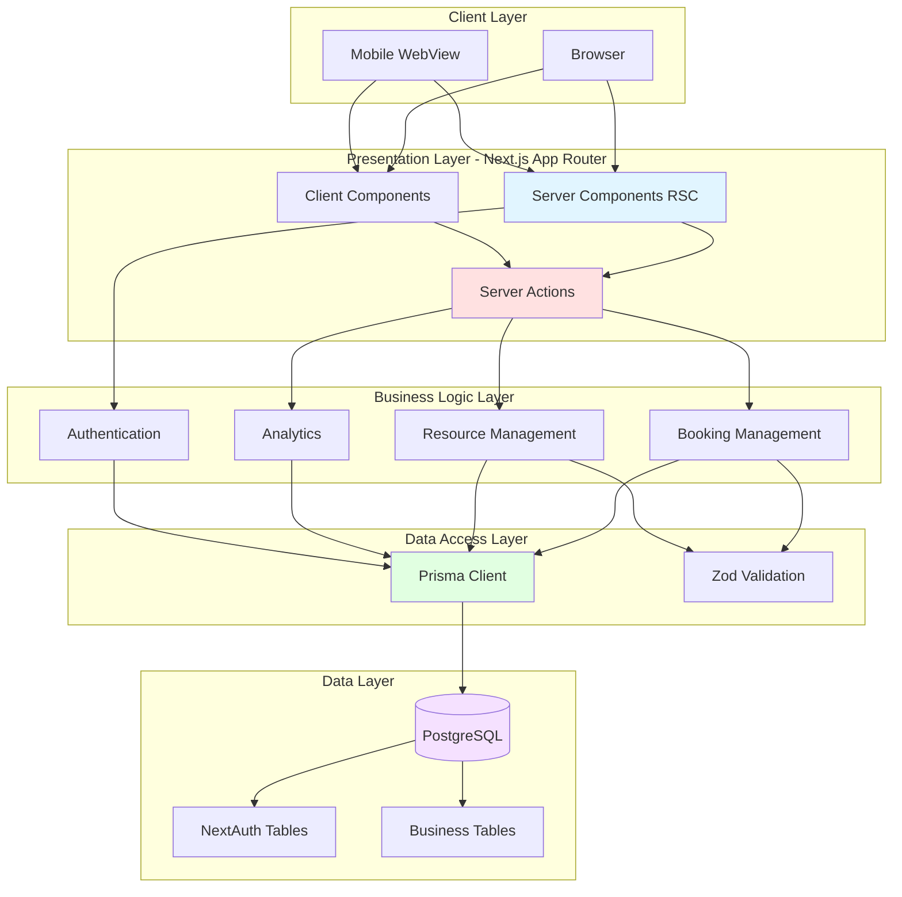
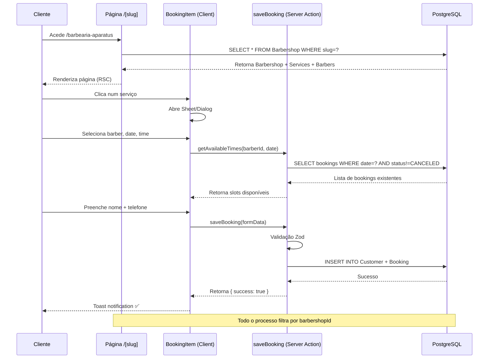

# 🏗️ Arquitetura — Aparatus

Documentação detalhada da arquitetura do sistema **Aparatus**, explicando o design multi-tenant, fluxo de dados, estrutura de pastas e padrões de código.

---

## 📋 Índice

1. [Visão Geral](#-visão-geral)
2. [Arquitetura Multi-tenant](#-arquitetura-multi-tenant)
3. [Diagrama da Arquitetura](#-diagrama-da-arquitetura)
4. [Fluxo de Dados](#-fluxo-de-dados)
5. [Estrutura de Pastas](#-estrutura-de-pastas)
6. [Padrões de Código](#-padrões-de-código)
7. [Decisões Arquiteturais](#-decisões-arquiteturais)

---

## 🎯 Visão Geral

O **Aparatus** segue uma arquitetura moderna baseada em:

- **Next.js 16 App Router** — Framework React com SSR/RSC
- **Server Components (RSC)** — Rendering no servidor por defeito
- **Server Actions** — Mutações sem API routes explícitas
- **Prisma ORM** — Type-safe database access
- **PostgreSQL** — Base de dados relacional
- **Slug-based Multi-tenancy** — Isolamento de dados via identificador único

### Princípios Arquiteturais

1. **Mobile-First** — UI otimizada para dispositivos móveis
2. **Type Safety** — TypeScript Strict Mode em todo o código
3. **Server-First** — Lógica de negócio no servidor (RSC + Server Actions)
4. **Progressive Enhancement** — Funcionalidade básica sem JavaScript
5. **Data Colocation** — Componentes buscam os próprios dados
6. **Zero-Bundle** — RSC não envia JavaScript ao cliente

---

## 🏢 Arquitetura Multi-tenant

### Conceito

Cada **Barbearia** (tenant) é identificada por um **slug único** (ex: `barbearia-aparatus`).
O slug funciona como:

- ✅ **Identificador público** na URL: `/[slug]`
- ✅ **Namespace de dados** — Todos os recursos pertencem ao tenant
- ✅ **Isolamento de segurança** — Queries filtradas por `barbershopId`

### Modelo de Ownership

```
User (Dono)
  └─ Barbershop (Tenant)
       ├─ Barbers (Profissionais)
       ├─ Services (Serviços oferecidos)
       ├─ Customers (Clientes)
       └─ Bookings (Agendamentos)
```

### Fluxo de Acesso

```mermaid
graph TD
    A[Cliente Final] -->|Acede via| B[/barbearia-aparatus]
    B -->|Query by slug| C[Barbershop Record]
    C -->|Carrega| D[Services + Barbers]
    D -->|Renderiza| E[Página Pública]
    
    F[Barbeiro/Admin] -->|Login OAuth| G[NextAuth Session]
    G -->|Verifica ownership| H[Barbershop Record]
    H -->|Redireciona| I[/admin Dashboard]
    
    style B fill:#f9f,stroke:#333,stroke-width:2px
    style I fill:#bbf,stroke:#333,stroke-width:2px
```

---

## 📊 Diagrama da Arquitetura

### Camadas do Sistema



### Fluxo de Agendamento (Exemplo)



---

## 🔄 Fluxo de Dados

### Server Components (Fetch → Render)

```typescript
// app/[slug]/page.tsx (Server Component)
export default async function BookingPage({ params }) {
  // ✅ Fetch direto na função do componente
  const barbershop = await prisma.barbershop.findUnique({
    where: { slug: params.slug },
    include: { services: true, barbers: true }
  });

  // ✅ Renderiza no servidor (HTML enviado ao cliente)
  return <BookingLayout data={barbershop} />;
}
```

**Vantagens:**
- Sem waterfalls de requests
- SEO friendly
- Dados nunca expostos ao cliente

---

### Client Components (Interatividade)

```typescript
// components/booking-item.tsx (Client Component)
'use client';

export function BookingItem({ service }) {
  const [date, setDate] = useState<Date>();
  const [isLoading, startTransition] = useTransition();

  async function handleSubmit() {
    startTransition(async () => {
      // ✅ Chama Server Action
      const result = await saveBooking(formData);
      if (result.success) toast.success('Agendado!');
    });
  }

  return (
    <Sheet>
      <Calendar onSelect={setDate} />
      <Button onClick={handleSubmit}>Confirmar</Button>
    </Sheet>
  );
}
```

**Quando usar Client Components:**
- Hooks React (`useState`, `useEffect`, `useTransition`)
- Event listeners (`onClick`, `onChange`)
- Browser APIs (`localStorage`, `window`)
- Animações e interações

---

### Server Actions (Mutações)

```typescript
// app/_actions/save-booking.ts
'use server';

export async function saveBooking(data: FormData) {
  // ✅ Validação Zod
  const schema = z.object({
    barberId: z.string().uuid(),
    date: z.coerce.date(),
    // ...
  });
  const validated = schema.parse(Object.fromEntries(data));

  // ✅ Lógica de negócio
  const isAvailable = await checkAvailability(validated);
  if (!isAvailable) return { success: false, error: 'Horário ocupado' };

  // ✅ Transação no banco
  const booking = await prisma.booking.create({
    data: validated
  });

  // ✅ Revalidate cache
  revalidatePath('/admin/bookings');

  return { success: true, booking };
}
```

**Vantagens:**
- Type-safe (input e output tipados)
- Sem endpoint exposto
- Automaticamente serializado (Next.js)
- Suporte a `FormData` e `useTransition`

---

## 📁 Estrutura de Pastas

### Visão Geral

```
src/
├── app/                         # Next.js App Router
│   ├── layout.tsx               # Root layout (Geist font, theme)
│   ├── page.tsx                 # Homepage (/)
│   ├── globals.css              # Estilos globais + Tailwind
│   │
│   ├── [slug]/                  # 🌍 Rotas Públicas (Multi-tenant)
│   │   └── page.tsx             # Página de agendamento
│   │
│   ├── admin/                   # 🔒 Rotas Protegidas
│   │   ├── page.tsx             # Dashboard principal
│   │   ├── barbers/             # CRUD Barbeiros
│   │   ├── services/            # CRUD Serviços
│   │   └── bookings/            # Listagem de agendamentos
│   │
│   ├── login/                   # Página de autenticação
│   │   └── page.tsx
│   │
│   ├── api/                     # API Routes (apenas NextAuth)
│   │   └── auth/[...nextauth]/
│   │       └── route.ts
│   │
│   └── _actions/                # 🎯 Server Actions
│       ├── save-booking.ts
│       ├── get-available-times.ts
│       ├── create-barbershop.ts
│       ├── manage-barbers.ts
│       └── ...
│
├── components/                  # Componentes React
│   ├── booking-item.tsx         # Flow de agendamento (Client)
│   ├── admin/                   # Componentes do dashboard
│   │   ├── admin-header.tsx
│   │   ├── overview-chart.tsx
│   │   └── user-nav.tsx
│   └── ui/                      # shadcn/ui components
│       ├── button.tsx
│       ├── calendar.tsx
│       ├── dialog.tsx
│       └── ...
│
├── lib/                         # Utilitários e configuração
│   ├── prisma.ts                # Singleton Prisma Client
│   └── utils.ts                 # Helpers (cn, formatPrice, etc)
│
└── assets/                      # Recursos estáticos
    ├── logo.tsx                 # Logo component (SVG)
    └── logo-minimal.tsx
```

---

### Convenções de Nomenclatura

| Tipo | Padrão | Exemplo |
|------|--------|---------|
| **Server Components** | PascalCase sem sufixo | `BookingPage`, `DashboardLayout` |
| **Client Components** | PascalCase + `'use client'` no topo | `BookingItem`, `DatePicker` |
| **Server Actions** | camelCase + verbo | `saveBooking`, `deleteBarber` |
| **Utilitários** | camelCase | `formatPrice`, `cn` |
| **Tipos/Interfaces** | PascalCase | `BookingData`, `ServiceFormValues` |
| **Pastas de rotas** | kebab-case | `[slug]`, `admin/barbers` |

---

## 🎨 Padrões de Código

### 1. Server Components (Padrão)

**Quando usar:** Por defeito em todos os componentes (exceto quando precisas de interatividade).

```typescript
// ✅ BOM: Server Component
async function BarbersList() {
  const barbers = await prisma.barber.findMany({
    where: { barbershopId: session.user.barbershopId }
  });

  return (
    <ul>
      {barbers.map(b => <li key={b.id}>{b.name}</li>)}
    </ul>
  );
}
```

**❌ EVITAR: Fetch no Client Component**
```typescript
'use client';
function BarbersList() {
  const [barbers, setBarbers] = useState([]);
  
  useEffect(() => {
    fetch('/api/barbers').then(r => r.json()).then(setBarbers);
  }, []);
  // ❌ Waterfall, bundle size, não SEO-friendly
}
```

---

### 2. Client Components (Apenas quando necessário)

**Quando usar:** Interatividade (forms, dialogs, animations).

```typescript
// ✅ BOM: Client Component para interatividade
'use client';

import { useState } from 'react';
import { Dialog, DialogContent } from '@/components/ui/dialog';
import { saveBarber } from '@/app/_actions/manage-barbers';

export function SaveBarberDialog() {
  const [open, setOpen] = useState(false);
  
  async function handleSubmit(formData: FormData) {
    await saveBarber(formData);
    setOpen(false); // ✅ State management no cliente
  }

  return (
    <Dialog open={open} onOpenChange={setOpen}>
      <DialogContent>
        <form action={handleSubmit}>
          {/* ... */}
        </form>
      </DialogContent>
    </Dialog>
  );
}
```

---

### 3. Server Actions (Lógica de Negócio)

**Estrutura recomendada:**

```typescript
'use server';

import { z } from 'zod';
import { prisma } from '@/lib/prisma';
import { revalidatePath } from 'next/cache';
import { getServerSession } from 'next-auth';

// 1️⃣ Schema de validação
const schema = z.object({
  name: z.string().min(1),
  price: z.coerce.number().positive(),
  duration: z.coerce.number().int().positive()
});

// 2️⃣ Server Action
export async function upsertService(formData: FormData) {
  try {
    // 3️⃣ Autenticação
    const session = await getServerSession();
    if (!session) return { success: false, error: 'Não autenticado' };

    // 4️⃣ Validação
    const data = schema.parse(Object.fromEntries(formData));

    // 5️⃣ Autorização (ownership check)
    const barbershop = await prisma.barbershop.findUnique({
      where: { id: session.user.barbershopId }
    });
    if (!barbershop) return { success: false, error: 'Barbearia não encontrada' };

    // 6️⃣ Operação no banco
    const service = await prisma.service.upsert({
      where: { id: data.id || '' },
      create: { ...data, barbershopId: barbershop.id },
      update: data
    });

    // 7️⃣ Revalidate cache
    revalidatePath('/admin/services');

    // 8️⃣ Retorno tipado
    return { success: true, service };
  } catch (error) {
    // 9️⃣ Error handling
    if (error instanceof z.ZodError) {
      return { success: false, error: 'Dados inválidos' };
    }
    console.error('upsertService error:', error);
    return { success: false, error: 'Erro ao salvar serviço' };
  }
}
```

---

### 4. Prisma Singleton Pattern

**Sempre usar o singleton** em `lib/prisma.ts`:

```typescript
// ✅ BOM
import { prisma } from '@/lib/prisma';

async function getBookings() {
  return prisma.booking.findMany();
}
```

**❌ EVITAR: Criar nova instância**
```typescript
import { PrismaClient } from '@prisma/client';
const prisma = new PrismaClient(); // ❌ Memory leak em dev
```

---

### 5. TypeScript Strict Mode

**Sempre tipar:**

```typescript
// ✅ BOM: Interface explícita
interface BookingFormProps {
  barberId: string;
  serviceId: string;
  onSuccess?: () => void;
}

export function BookingForm({ barberId, serviceId, onSuccess }: BookingFormProps) {
  // ...
}
```

**❌ EVITAR: any**
```typescript
function BookingForm(props: any) { // ❌
  // ...
}
```

---

### 6. Validação com Zod

**Sempre validar inputs:**

```typescript
import { z } from 'zod';

const bookingSchema = z.object({
  date: z.coerce.date().refine(d => d > new Date(), 'Data deve ser futura'),
  barberId: z.string().uuid(),
  phone: z.string().regex(/^\d{9}$/, 'Telefone inválido')
});

// Parse e valida
const validated = bookingSchema.parse(data);
```

---

## 🧠 Decisões Arquiteturais

### Por que Next.js App Router?

**Vantagens escolhidas:**
- ✅ Server Components reduzem bundle size em ~70%
- ✅ Server Actions eliminam necessidade de API routes
- ✅ Streaming e Suspense nativos
- ✅ Melhor SEO (páginas públicas são SSR)
- ✅ Colocation de dados e UI

---

### Por que Slug-based Multi-tenancy?

**Alternativas consideradas:**

| Abordagem | Pros | Contras | Decisão |
|-----------|------|---------|---------|
| **Slug-based** ✅ | SEO friendly, URL limpo, simples | Slug colisions (resolvido com unique constraint) | **Escolhido** |
| Subdomain-based | Isolamento forte | DNS config, SSL por tenant | ❌ Over-engineering para MVP |
| Path-based (`/tenant/xyz`) | Simples | URL não "profissional" | ❌ UX inferior |

---

### Por que Prisma?

**vs. Drizzle/Kysely:**
- ✅ Migrations automáticas
- ✅ Type-safety nativo
- ✅ Introspection de schema
- ✅ Ecosystem maduro (Prisma Studio, extensions)

---

### Por que não tRPC?

**Decisão:** Server Actions já fornecem type-safety end-to-end sem boilerplate adicional.

**Trade-offs:**
- ✅ Menos código
- ✅ Nativamente integrado com Next.js
- ❌ Menos flexível para clientes non-Next.js (não é um problema para o Aparatus)

---

## 🔒 Segurança e Isolamento

### Filtros Automáticos por Tenant

```typescript
// ✅ Sempre filtrar por barbershopId
const services = await prisma.service.findMany({
  where: { barbershopId: session.user.barbershopId } // ✅
});

// ❌ NUNCA fazer queries globais sem filtro
const allServices = await prisma.service.findMany(); // ❌ PERIGOSO
```

---

### Middleware de Autenticação

```typescript
// app/admin/layout.tsx
export default async function AdminLayout({ children }) {
  const session = await getServerSession();
  
  if (!session) {
    redirect('/login'); // ✅ Protected route
  }

  return <>{children}</>;
}
```

---

## 📈 Performance

### Estratégias Implementadas

1. **Server Components** — Zero JavaScript no cliente por defeito
2. **Prisma Queries Otimizadas** — Uso de `include` e `select` para evitar N+1
3. **Next.js Caching** — `revalidatePath` para cache selectivo
4. **Standalone Build** — Docker image otimizado (~350MB)
5. **date-fns** — Alternativa leve ao Moment.js (~11KB)

---

## 🚀 Próximos Passos Arquiteturais (Roadmap)

1. **Caching Layer** — Redis para session storage e rate limiting
2. **Queue System** — Bull/BullMQ para processamento assíncrono (emails, WhatsApp)
3. **Event-Driven** — Webhooks para integrações externas
4. **Multi-região** — Edge functions para latência baixa
5. **Feature Flags** — LaunchDarkly ou similar para rollout gradual

---

<div align="center">

**Arquitetura sólida para crescimento escalável** 🏗️

[⬆ Voltar ao topo](#-arquitetura--aparatus) • [📚 Documentação](./README.md)

</div>
