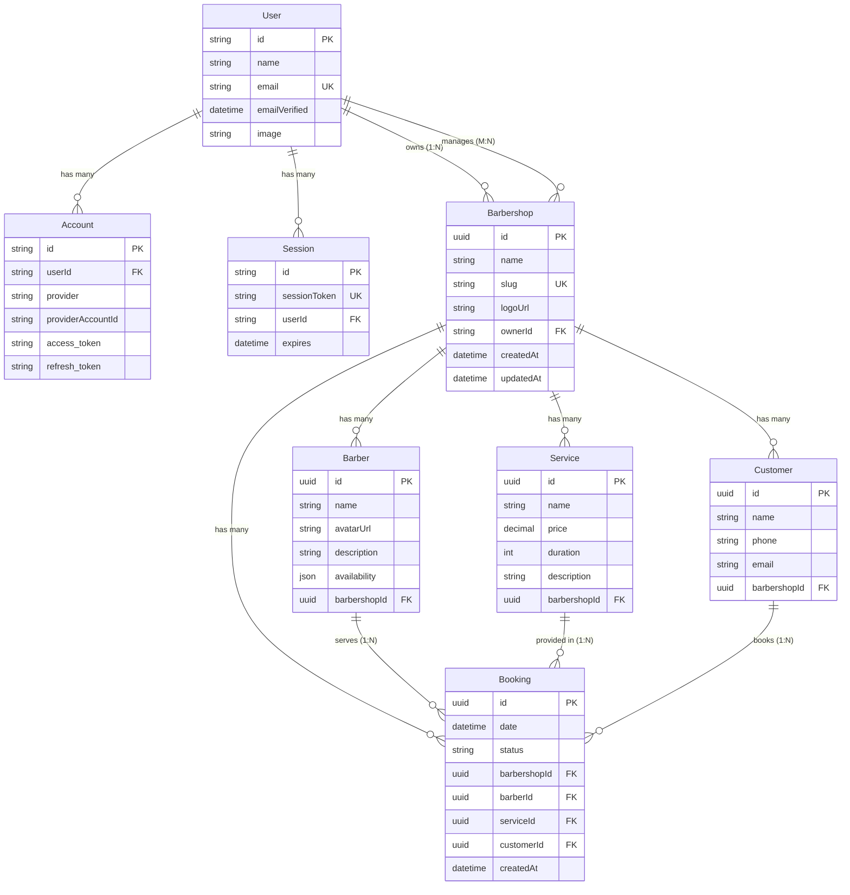

# 💾 Base de Dados — Aparatus

Documentação completa do schema da base de dados, incluindo diagrama ERD, explicação de modelos, relações e queries comuns com Prisma.

---

## 📋 Índice

1. [Visão Geral](#-visão-geral)
2. [Diagrama ERD](#-diagrama-erd)
3. [Modelos de Autenticação](#-modelos-de-autenticação-nextauth)
4. [Modelos de Negócio](#-modelos-de-negócio)
5. [Relações entre Entidades](#-relações-entre-entidades)
6. [Queries Comuns](#-queries-comuns)
7. [Migrations e Seeds](#-migrations-e-seeds)

---

## 🎯 Visão Geral

O **Aparatus** usa **PostgreSQL 16+** como base de dados relacional, gerida através do **Prisma ORM**.

### Estatísticas do Schema

- **8 Modelos** (4 NextAuth + 4 Negócio)
- **13 Relações** (Foreign Keys)
- **3 Índices Únicos** (slug, email, sessionToken)
- **1 Campo JSON** (availability)

### Provider

```prisma
datasource db {
  provider = "postgresql"
  url      = env("DATABASE_URL")
}
```

---

## 🗺️ Diagrama ERD

### Entity-Relationship Diagram



---

## 🔐 Modelos de Autenticação (NextAuth)

### User

**Descrição:** Utilizadores da plataforma (donos e gestores de barbearias).

```prisma
model User {
  id            String    @id @default(cuid())
  name          String?
  email         String?   @unique
  emailVerified DateTime?
  image         String?
  accounts      Account[]
  sessions      Session[]
  barbershopsOwning   Barbershop[]
  barbershopsManaging Barbershop[] @relation("BarbershopManagers")
}
```

**Campos:**
- `id` — Identificador único (CUID gerado pelo NextAuth)
- `email` — Email único (usado para login Google OAuth)
- `image` — URL da foto do perfil (Google Avatar)
- `barbershopsOwning` — Barbearias que este User criou (ownership)
- `barbershopsManaging` — Barbearias que este User pode gerir (relação M:N)

**Relações:**
- `1:N` com **Account** (um user pode ter múltiplos providers OAuth)
- `1:N` com **Session** (múltiplas sessões ativas)
- `1:N` com **Barbershop** (via `ownerId`)
- `M:N` com **Barbershop** (via `users[]` — para futura funcionalidade de team)

---

### Account

**Descrição:** Guarda informação sobre contas OAuth vinculadas ao User.

```prisma
model Account {
  id                String  @id @default(cuid())
  userId            String
  type              String
  provider          String  // ex: "google"
  providerAccountId String  // ID do user no Google
  refresh_token     String? @db.Text
  access_token      String? @db.Text
  expires_at        Int?
  token_type        String?
  scope             String?
  id_token          String? @db.Text
  session_state     String?
  
  user User @relation(fields: [userId], references: [id], onDelete: Cascade)
  
  @@unique([provider, providerAccountId])
}
```

**Índice Único:** `[provider, providerAccountId]` — Garante que cada user não pode vincular a mesma conta Google duas vezes.

---

### Session

**Descrição:** Sessões ativas de utilizadores (stored in database).

```prisma
model Session {
  id           String   @id @default(cuid())
  sessionToken String   @unique
  userId       String
  expires      DateTime
  user         User     @relation(fields: [userId], references: [id], onDelete: Cascade)
}
```

**Campos:**
- `sessionToken` — Token único usado em cookies
- `expires` — Data de expiração da sessão

---

### VerificationToken

**Descrição:** Tokens de verificação de email (não usado no MVP, mas necessário para NextAuth).

```prisma
model VerificationToken {
  identifier String   // Email ou user ID
  token      String   @unique
  expires    DateTime
  
  @@unique([identifier, token])
}
```

---

## 🏢 Modelos de Negócio

### Barbershop (Tenant)

**Descrição:** Entidade principal do sistema multi-tenant. Representa uma barbearia física.

```prisma
model Barbershop {
  id        String   @id @default(uuid())
  name      String
  slug      String   @unique
  logoUrl   String?
  createdAt DateTime @default(now())
  updatedAt DateTime @updatedAt
  
  ownerId String
  owner   User   @relation(fields: [ownerId], references: [id])
  
  barbers   Barber[]
  services  Service[]
  bookings  Booking[]
  customers Customer[]
  users     User[] @relation("BarbershopManagers")
}
```

**Campos:**
- `slug` — **Identificador único público** (ex: `barbearia-aparatus`)
  - Usado na URL: `/[slug]`
  - Deve ser lowercase, sem espaços, URL-friendly
  - Índice único garante não haver duplicados
- `ownerId` — Foreign Key para `User` (quem criou a barbearia)
- `logoUrl` — URL da imagem do logo (ex: Unsplash, UploadThing)

**Relações:**
- `1:N` com **Barber** — Uma barbearia tem múltiplos barbeiros
- `1:N` com **Service** — Uma barbearia oferece múltiplos serviços
- `1:N` com **Booking** — Múltiplos agendamentos
- `1:N` com **Customer** — Base de clientes privada por barbearia
- `N:1` com **User** (owner)
- `M:N` com **User** (managers, funcionalidade futura)

**Isolamento de Dados:**
Todos os recursos (Barber, Service, Booking, Customer) pertencem a uma **Barbershop** específica via `barbershopId`.

---

### Barber (Professional)

**Descrição:** Barbeiro/profissional que atende clientes.

```prisma
model Barber {
  id          String  @id @default(uuid())
  name        String
  avatarUrl   String?
  description String?
  availability Json?
  
  barbershopId String
  barbershop   Barbershop @relation(fields: [barbershopId], references: [id])
  bookings     Booking[]
}
```

**Campos:**
- `availability` — **Campo JSON** com horários disponíveis por dia da semana

**Formato de `availability`:**

**Opção A: Array de horários predefinidos**
```json
{
  "monday": ["09:00", "09:45", "10:30", "11:15", "14:00", "15:00"],
  "tuesday": ["09:00", "10:00", "11:00"],
  "wednesday": [],
  "thursday": ["09:00", "10:00"],
  "friday": ["09:00", "10:00"],
  "saturday": [],
  "sunday": []
}
```

**Opção B: Range de horários (configurável no admin)**
```json
{
  "monday": { "available": true, "start": "09:00", "end": "18:00" },
  "tuesday": { "available": true, "start": "09:00", "end": "18:00" },
  "wednesday": { "available": false },
  "thursday": { "available": true, "start": "09:00", "end": "18:00" },
  "friday": { "available": true, "start": "09:00", "end": "18:00" },
  "saturday": { "available": true, "start": "10:00", "end": "14:00" },
  "sunday": { "available": false }
}
```

**Relações:**
- `N:1` com **Barbershop**
- `1:N` com **Booking** — Um barbeiro tem múltiplos agendamentos

---

### Service

**Descrição:** Serviço oferecido pela barbearia (ex: Corte, Barba, Combo).

```prisma
model Service {
  id          String  @id @default(uuid())
  name        String
  price       Decimal @db.Decimal(10, 2)
  duration    Int     // minutos
  description String?
  
  barbershopId String
  barbershop   Barbershop @relation(fields: [barbershopId], references: [id])
  bookings     Booking[]
}
```

**Campos:**
- `price` — Valor em Decimal(10,2) — Ex: 45.00 = €45
- `duration` — Duração em minutos (usado pelo algoritmo de disponibilidade)
- `description` — Descrição detalhada do serviço (opcional)

**Relações:**
- `N:1` com **Barbershop**
- `1:N` com **Booking** — Um serviço pode estar em múltiplos agendamentos

---

### Customer

**Descrição:** Cliente que agenda serviços (não tem login, apenas dados de contacto).

```prisma
model Customer {
  id    String  @id @default(uuid())
  name  String
  phone String
  email String?
  
  barbershopId String
  barbershop   Barbershop @relation(fields: [barbershopId], references: [id])
  bookings     Booking[]
}
```

**Campos:**
- `phone` — Telefone normalizado (apenas dígitos, sem `+` ou espaços)
  - Usado como identificador único por barbearia (lógica em Server Action)
- `email` — Opcional (para futuras notificações)

**Relações:**
- `N:1` com **Barbershop** — Cada cliente pertence a uma barbearia
- `1:N` com **Booking** — Um cliente pode ter múltiplos agendamentos

**Nota de Privacidade:**
Clientes são **isolados por barbearia**. A mesma pessoa pode ter registos diferentes em barbearias diferentes.

---

### Booking (Agendamento)

**Descrição:** Agendamento de um serviço com um barbeiro numa data/hora específica.

```prisma
model Booking {
  id     String   @id @default(uuid())
  date   DateTime
  status String   @default("CONFIRMED")
  
  barbershopId String
  barbershop   Barbershop @relation(fields: [barbershopId], references: [id])
  
  barberId String
  barber   Barber @relation(fields: [barberId], references: [id])
  
  serviceId String
  service   Service @relation(fields: [serviceId], references: [id])
  
  customerId String
  customer   Customer @relation(fields: [customerId], references: [id])
  
  createdAt DateTime @default(now())
}
```

**Campos:**
- `date` — **DateTime** com data e hora do agendamento (ex: `2026-01-25T14:30:00`)
- `status` — String com valores:
  - `PENDING` — Aguardando confirmação
  - `CONFIRMED` — Confirmado (padrão)
  - `CANCELED` — Cancelado pelo cliente ou admin
  - `COMPLETED` — Serviço foi realizado

**Relações:**
- `N:1` com **Barbershop**
- `N:1` com **Barber**
- `N:1` com **Service**
- `N:1` com **Customer**

**Validações (em Server Actions):**
- Data deve ser futura
- Horário deve estar na availability do barbeiro
- Não pode haver outro booking no mesmo horário para o mesmo barbeiro
- Status CANCELED não conta como conflito

---

## 🔗 Relações entre Entidades

### Diagrama de Dependências

```
User (1)
  └─── owns ────> Barbershop (N)
                      ├─── has ────> Barber (N)
                      ├─── offers ───> Service (N)
                      ├─── serves ───> Customer (N)
                      └─── records ──> Booking (N)
                                         ├─ with ──> Barber (1)
                                         ├─ for ───> Service (1)
                                         └─ by ────> Customer (1)
```

### Cardinalidades

| Relação | Tipo | Descrição |
|---------|------|-----------|
| User → Barbershop | `1:N` | Um user pode criar múltiplas barbearias |
| Barbershop → Barber | `1:N` | Uma barbearia tem múltiplos barbeiros |
| Barbershop → Service | `1:N` | Uma barbearia oferece múltiplos serviços |
| Barbershop → Customer | `1:N` | Cada barbearia tem a sua base de clientes |
| Barbershop → Booking | `1:N` | Múltiplos agendamentos por barbearia |
| Barber → Booking | `1:N` | Um barbeiro atende múltiplos agendamentos |
| Service → Booking | `1:N` | Um serviço pode ser agendado múltiplas vezes |
| Customer → Booking | `1:N` | Um cliente pode fazer múltiplos agendamentos |

---

## 🔍 Queries Comuns

### 1. Buscar Barbearia por Slug (Página Pública)

```typescript
const barbershop = await prisma.barbershop.findUnique({
  where: { slug: 'barbearia-aparatus' },
  include: {
    services: true,
    barbers: {
      select: {
        id: true,
        name: true,
        avatarUrl: true,
        description: true,
        availability: true
      }
    }
  }
});
```

**Retorna:**
```typescript
{
  id: "uuid",
  name: "Barbearia Aparatus",
  slug: "barbearia-aparatus",
  logoUrl: "https://...",
  services: [
    { id: "uuid", name: "Corte", price: 45.00, duration: 45 },
    // ...
  ],
  barbers: [
    { id: "uuid", name: "João", avatarUrl: "https://...", availability: {...} },
    // ...
  ]
}
```

---

### 2. Criar Agendamento (com upsert de Customer)

```typescript
// 1. Busca ou cria customer pelo telefone normalizado
const customer = await prisma.customer.upsert({
  where: {
    phone_barbershopId: {
      phone: normalizedPhone,
      barbershopId: barbershopId
    }
  },
  create: {
    name: customerName,
    phone: normalizedPhone,
    barbershopId: barbershopId
  },
  update: {
    name: customerName // Atualiza nome se mudou
  }
});

// 2. Cria booking
const booking = await prisma.booking.create({
  data: {
    date: new Date(bookingDate),
    barbershopId: barbershopId,
    barberId: barberId,
    serviceId: serviceId,
    customerId: customer.id,
    status: 'CONFIRMED'
  }
});
```

---

### 3. Verificar Disponibilidade (Algoritmo)

```typescript
import { isSameDay, format, parse, addMinutes } from 'date-fns';

async function getAvailableTimes(barberId: string, date: Date) {
  // 1. Busca barbeiro
  const barber = await prisma.barber.findUnique({
    where: { id: barberId },
    include: { barbershop: { include: { services: true } } }
  });

  // 2. Pega availability do JSON
  const dayOfWeek = format(date, 'EEEE').toLowerCase(); // "monday"
  const availabilityData = barber.availability as Record<string, string[]>;
  const daySlots = availabilityData[dayOfWeek] || [];

  // 3. Busca bookings existentes no dia
  const bookings = await prisma.booking.findMany({
    where: {
      barberId: barberId,
      date: {
        gte: startOfDay(date),
        lte: endOfDay(date)
      },
      status: { not: 'CANCELED' }
    },
    include: { service: true }
  });

  // 4. Filtra slots ocupados
  const occupiedSlots = bookings.map(b => {
    const start = format(b.date, 'HH:mm');
    const end = format(addMinutes(b.date, b.service.duration), 'HH:mm');
    return { start, end };
  });

  // 5. Retorna slots livres
  return daySlots.filter(slot => {
    return !occupiedSlots.some(occupied => {
      // Lógica de overlap
      return slot >= occupied.start && slot < occupied.end;
    });
  });
}
```

---

### 4. Dashboard Metrics (Analytics)

```typescript
import { startOfDay, startOfMonth, subDays } from 'date-fns';

async function getDashboardMetrics(barbershopId: string) {
  const today = startOfDay(new Date());
  const monthStart = startOfMonth(new Date());

  // Receita de hoje
  const todayRevenue = await prisma.booking.aggregate({
    where: {
      barbershopId,
      date: { gte: today },
      status: 'COMPLETED'
    },
    _sum: { service: { price: true } }
  });

  // Receita do mês
  const monthRevenue = await prisma.booking.aggregate({
    where: {
      barbershopId,
      date: { gte: monthStart },
      status: 'COMPLETED'
    },
    _sum: { service: { price: true } }
  });

  // Total de agendamentos do mês
  const monthBookingsCount = await prisma.booking.count({
    where: {
      barbershopId,
      date: { gte: monthStart }
    }
  });

  // Receita dos últimos 7 dias (para gráfico)
  const last7Days = await Promise.all(
    Array.from({ length: 7 }).map(async (_, i) => {
      const day = subDays(today, 6 - i);
      const revenue = await prisma.booking.aggregate({
        where: {
          barbershopId,
          date: { gte: day, lt: addDays(day, 1) },
          status: 'COMPLETED'
        },
        _sum: { service: { price: true } }
      });
      return {
        date: format(day, 'dd MMM'),
        revenue: revenue._sum.service?.price || 0
      };
    })
  );

  return {
    todayRevenue: todayRevenue._sum.service?.price || 0,
    monthRevenue: monthRevenue._sum.service?.price || 0,
    monthBookingsCount,
    last7DaysData: last7Days
  };
}
```

---

### 5. Listar Agendamentos por Data (Admin)

```typescript
async function getBookingsByDate(barbershopId: string, date: Date) {
  const bookings = await prisma.booking.findMany({
    where: {
      barbershopId,
      date: {
        gte: startOfDay(date),
        lte: endOfDay(date)
      }
    },
    include: {
      barber: { select: { name: true, avatarUrl: true } },
      service: { select: { name: true, duration: true } },
      customer: { select: { name: true, phone: true } }
    },
    orderBy: { date: 'asc' }
  });

  return bookings;
}
```

**Retorna:**
```typescript
[
  {
    id: "uuid",
    date: "2026-01-25T14:30:00",
    status: "CONFIRMED",
    barber: { name: "João Navalha", avatarUrl: "..." },
    service: { name: "Corte Clássico", duration: 45 },
    customer: { name: "Gabriel Silva", phone: "912345678" }
  },
  // ...
]
```

---

## 🗃️ Migrations e Seeds

### Migrations

**Localização:** `prisma/migrations/`

**Histórico:**
- `20260116223031_fix_user_barber_relation` — Migration inicial com todos os modelos

**Comandos:**

```bash
# Criar nova migration
npx prisma migrate dev --name add_booking_notes

# Aplicar migrations em produção
npx prisma migrate deploy

# Reset completo (⚠️ apaga dados)
npx prisma migrate reset --force
```

---

### Seed

**Localização:** `prisma/seed.ts`

**Execução:**
```bash
pnpm run db:seed
```

**Dados Criados:**

1. **User Admin**
   ```typescript
   {
     email: "admin@aparatus.com",
     name: "Admin Aparatus"
   }
   ```

2. **Barbershop**
   ```typescript
   {
     name: "Barbearia Aparatus",
     slug: "barbearia-aparatus",
     logoUrl: "https://images.unsplash.com/..."
   }
   ```

3. **4 Services**
   - Corte Clássico — €45 (45 min)
   - Barba Completa — €35 (30 min)
   - Pézinho — €15 (15 min)
   - Combo Completo — €70 (60 min)

4. **2 Barbers**
   - João Navalha (Seg-Sex 09:00-18:00)
   - Carlos Tesoura (Seg-Sex 09:00-18:00)

**Nota:** O seed é **idempotente** (pode ser executado múltiplas vezes sem duplicar dados, graças ao `upsert`).

---

## 🔒 Segurança

### Row-Level Security (Manual)

Como o Prisma não suporta RLS nativamente, **todas as queries devem filtrar por `barbershopId`:**

```typescript
// ✅ CORRETO
const services = await prisma.service.findMany({
  where: { barbershopId: session.user.barbershopId }
});

// ❌ PERIGOSO (expõe dados de todas as barbearias)
const allServices = await prisma.service.findMany();
```

### Soft Deletes (Futuro)

Atualmente, deletes são **hard deletes**. Para produção, considerar:

```prisma
model Service {
  // ...
  deletedAt DateTime?
}
```

---

## 📈 Performance

### Índices Existentes

- `Barbershop.slug` — Índice único (usado em queries públicas)
- `User.email` — Índice único (login)
- `Session.sessionToken` — Índice único (autenticação)

### Otimizações Recomendadas (Futuro)

```prisma
// Índice composto para queries de booking
@@index([barbershopId, date])

// Índice para customer lookup
@@index([barbershopId, phone])
```

---

## 🛠️ Ferramentas Úteis

### Prisma Studio

Interface gráfica para explorar dados:

```bash
npx prisma studio
```

Abre em `http://localhost:5555`

### Prisma Format

Formata o schema automaticamente:

```bash
npx prisma format
```

---

<div align="center">

**Base de dados sólida e escalável** 💾

[⬆ Voltar ao topo](#-base-de-dados--aparatus) • [📚 Documentação](./README.md)

</div>
